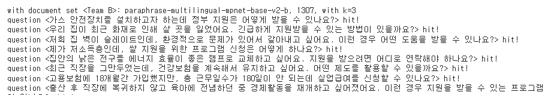

## 개요

RAG System의 성능 향상을 위한 하나의 방법으로 Embedding Model의 개선을 통한 Retrieval(검색) 정확도 증가를 목적으로 한다.
목적을 위해 Baseline으로 이용할 Embedding Model 선정 및 평가 과정을 간단하게 소개하면 다음과 같다.

1. Hugging Face MTEB Model 혹은 상용 Embedding Model (OpenAI, Anthropic, Cohere 등) list-up 후 기준에 맞추어 선정
2. LLM을 이용해 Data <2023 나에게 힘이 되는 복지서비스>를 기반으로 , 질문-답변-참조 문서 순서로 QA Dataset 생성
3. 문서 자체를 각각의 Embedding Model을 통해 Vectorize 한 후, Vector DB에 각각의 collection별로 저장
4. 생성한 QA Dataset에 있는 질문을 Embedding 한 후 Query로 VectorDB에 넣었을 때, 참조 문서가 retrieve 되는지 확인하고 만약 있다면 hit, 아니면 false의 간단한 형태로 metric 작성
5. List-up한 모든 Embedding Model에 이전 절차를 수행한 후, 평가하고 가장 점수가 높은 Embedding Model을 Baseline으로 사용

상세한 모델 선정 및 평가 과정은 후술.
___
## 1. 모델 선정

Model 선정에 있어서 기준은 다음의 기준으로 진행하였다.
- Open source 모델이라면 Sentence Transformer 기반의 Sentence Embedding Model
- 한국어로 pre-train된 모델
- Multi-lingual 한 모델이라면 한국어를 지원하는 모델

Hugging Face, 상용 Embedding Model을 조사했고, 후보로 사용한 모델의 list는 다음과 같다.

```
sentence-transformers/paraphrase-multilingual-mpnet-base-v2
sentence-transformers/paraphrase-multilingual-MiniLM-L12-v2
sentence-transformers/distiluse-base-multilingual-cased-v2
sentence-transformers/stsb-xlm-r-multilingual
jhgan/ko-sroberta-multitask
snunlp/KR-SBERT-V40K-klueNLI-augSTS
bongsoo/moco-sentencedistilbertV2.1
bongsoo/kpf-sbert-128d-v1
M-CLIP/M-BERT-Distil-40
google/canine-c
smartmind/roberta-ko-small-tsdae
BM-K/KoSimCSE-roberta-multitask
OpenAI/text-embedding-ada-002
```

___
## 2. QA Dataset 생성

 [QA generator](https://github.com/ssisOneTeam/Korean-Embedding-Model-Performance-Benchmark-for-Retriever/tree/main/QA_generator) 참조
 
___
## 3. Dataset Embed

 - [Chromadb](https://docs.trychroma.com/)를 이용해 Model별 collection 지정 후 chroma 폴더에 저장 후 평가(질문 별 Hitrate) `set_chroma.ipynb` 참조
 
___
## 4. Hitrate 평가

- 방법
 1. 생성한 QA Dataset을 기반으로 각 모델, 문서 형태 별 collection에 Cosine 유사도 방식의 Query 검색을 진행한다.
 2. 만약 QA Dataset의 유사도가 Retreive 한 문서 개수와 일치(@1, @3, @5 등 가장 가까운 문서 여러개를 추출하도록 했음)한다면 "hit"한 것으로 판정해서 비율을 계산
 3. 추산한 비율들을 종합한 후 list-up

- 예시


- Why Hitrate?
	- Vector DB의 검색 정확도를 판별하기 위해서 추천 시스템의 여러 metric 중 relevant 한 것으로 평가하는 가장 단순하고 효과적인 방법이라고 생각하고 사용.

___
## 5. Result

| Model                                       | @1     | @3     | @5     | @10    | Average |
|---------------------------------------------|--------|--------|--------|--------|---------|
| paraphrase-multilingual-mpnet-base-v2-a     | 40.0   | 58.095 | 63.81  | 73.333 | 58.810  |
| paraphrase-multilingual-mpnet-base-v2-b     | 36.19  | 59.048 | 61.905 | 69.524 | 56.667  |
| paraphrase-multilingual-MiniLM-L12-v2-a     | 25.714 | 41.905 | 51.429 | 62.857 | 45.476  |
| paraphrase-multilingual-MiniLM-L12-v2-b     | 24.762 | 35.238 | 42.857 | 51.429 | 38.571  |
| distiluse-base-multilingual-cased-v2-a      | 24.762 | 39.048 | 47.619 | 59.048 | 42.619  |
| distiluse-base-multilingual-cased-v2-b      | 22.857 | 40.952 | 50.476 | 57.143 | 42.857  |
| stsb-xlm-r-multilingual-a                   | 20.952 | 33.333 | 41.905 | 53.333 | 37.381  |
| stsb-xlm-r-multilingual-b                   | 11.429 | 19.048 | 19.048 | 20.0   | 17.381  |
| ko-sroberta-multitask-a                     | 49.524 | 69.524 | 77.143 | 81.905 | 69.524  |
| ko-sroberta-multitask-b                     | 53.333 | 71.429 | 78.095 | 84.762 | 71.905  |
| KR-SBERT-V40K-klueNLI-augSTS-a              | 37.143 | 54.286 | 63.81  | 72.381 | 56.905  |
| KR-SBERT-V40K-klueNLI-augSTS-b              | 32.381 | 56.19  | 63.81  | 72.381 | 56.191  |
| moco-sentencedistilbertV2.1-a               | 7.619  | 11.429 | 11.429 | 20.0   | 12.619  |
| moco-sentencedistilbertV2.1-b               | 20.952 | 25.714 | 27.619 | 30.476 | 26.190  |
| kpf-sbert-128d-v1-a                         | 21.905 | 37.143 | 44.762 | 50.476 | 38.571  |
| kpf-sbert-128d-v1-b                         | 27.619 | 40.0   | 45.714 | 49.524 | 40.714  |
| M-BERT-Distil-40-a                          | 5.714  | 10.476 | 13.333 | 19.048 | 12.143  |
| M-BERT-Distil-40-b                          | 4.762  | 12.381 | 18.095 | 24.762 | 15.000  |
| canine-c-a                                  | 0.952  | 4.762  | 5.714  | 6.667  | 4.524   |
| canine-c-b                                  | 1.905  | 5.714  | 7.619  | 10.476 | 6.429   |
| roberta-ko-small-tsdae-a                    | 16.19  | 23.81  | 27.619 | 37.143 | 26.191  |
| roberta-ko-small-tsdae-b                    | 10.476 | 20.952 | 23.81  | 35.238 | 22.619  |
| KoSimCSE-roberta-multitask-a                | 37.143 | 58.095 | 63.81  | 72.381 | 57.857  |
| KoSimCSE-roberta-multitask-b                | 40.952 | 59.048 | 65.714 | 77.143 | 60.714  |
| text-embedding-ada-002-a                    | 41.905 | 47.619 | 57.143 | 60.0   | 51.667  |
| text-embedding-ada-002-b                    | 36.19  | 45.714 | 47.619 | 50.476 | 45.000  |

[ko-sroberta-multitask](https://huggingface.co/jhgan/ko-sroberta-multitask/) Model이 사용할 Dataset에서 추출한 106개의 QA 기반 `hitrate_test_qa`으로 Retrieve 한 Hitrate가 평균적으로 가장 높음을 확인할 수 있었고, 해당 모델을 Domain Adaption에 사용하는 것으로 결론내렸다.
___

## 기타 시행착오
